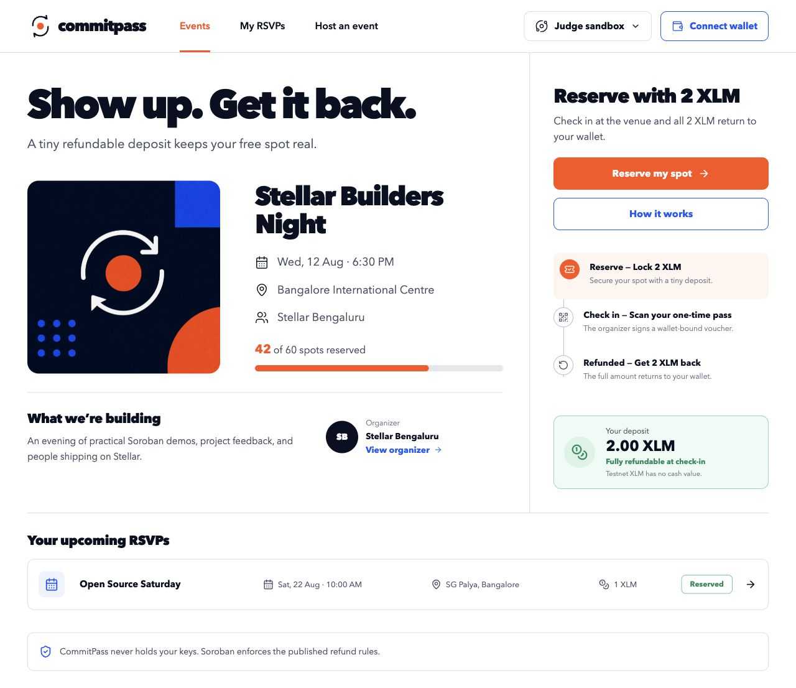
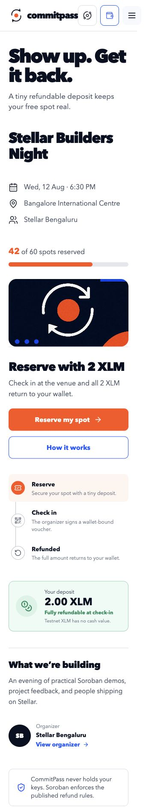
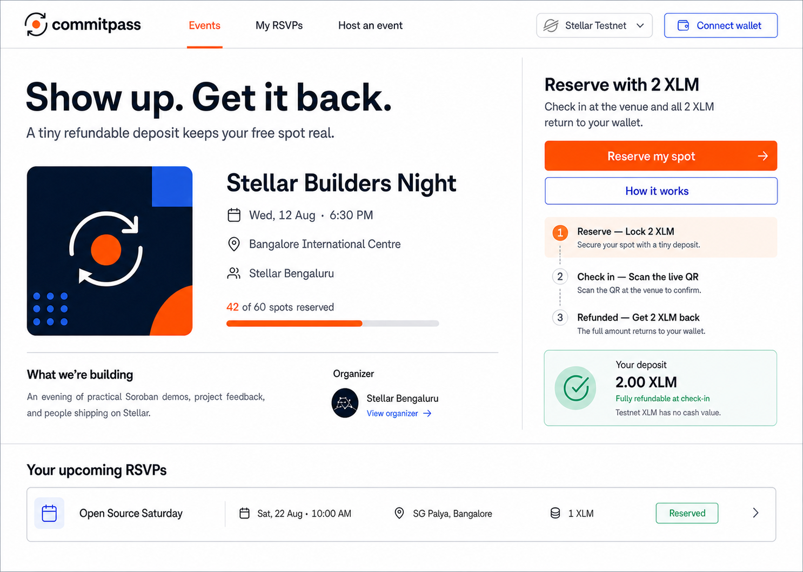
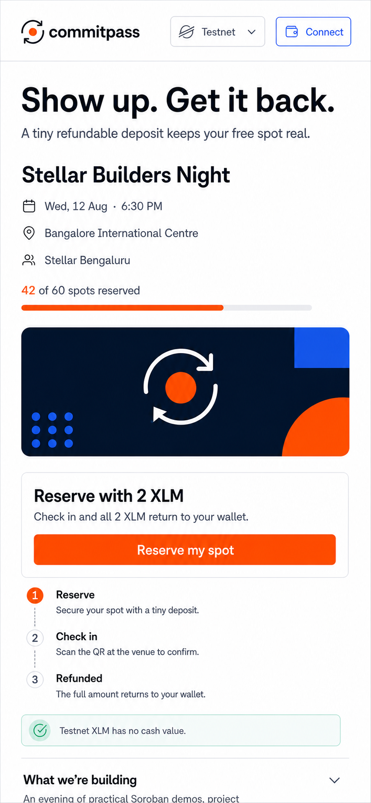

# CommitPass

**A refundable RSVP for real turnout.**

CommitPass lets an event organizer require a small XLM commitment for a free
event. An attendee reserves a place by locking the published amount in a
Soroban contract. At the venue, an event-scoped scanner signs a short-lived,
wallet-bound check-in voucher. The attendee submits that voucher and receives
the full deposit back. Unclaimed no-show deposits settle only to the beneficiary
disclosed before reservation.

This repository is a complete Stellar Journey to Mastery submission candidate:

- a polished responsive attendee and organizer web app;
- a protocol-27 Soroban contract with 22 passing Rust tests;
- generated TypeScript bindings and a typed application adapter;
- the official `@creit.tech/stellar-wallets-kit` 2.5.0 multi-wallet modal,
  network validation, and hardened transaction signing;
- a mounted live Testnet proof panel that reads the deployed contract, invokes
  `create_event` from the browser, shows the full transaction lifecycle, and
  reconciles contract events with authoritative reads;
- real camera QR scanning, strict pass validation, replay rejection, and local
  Ed25519 signing in the judge sandbox;
- a deterministic in-session demo for judges without wallet setup;
- a public Stellar Testnet deployment and complete on-chain lifecycle proof;
- a threat model, pilot plan, submission copy, and demo script.

## Try the product

Public production demo:
https://commitpass-stellar-rsvp.a-9724.chatgpt.site

Public source:
https://github.com/himanshu748/commitpass-stellar-rsvp

```sh
cd frontend
npm install
npm run dev
```

Open the local URL. The product deliberately offers two separate paths:

- **Use demo wallet** runs the complete RSVP → check-in → refund story locally
  without an extension or funds.
- **Verify wallet address** opens the official Stellar Wallets Kit chooser.
  After a Testnet wallet connects, the proof panel reads the deployed
  `CommitPass` contract and can invoke `create_event` only after the wallet
  shows its own confirmation. This write moves no tokens; the wallet pays only
  the Testnet network fee.

The full judge-sandbox flow is:

1. reserve the demo event with 2 Testnet XLM;
2. open the one-time check-in pass;
3. simulate the organizer scan;
4. claim the full refund;
5. create an organizer event and test the scanner fallback.

RSVP, check-in, and refund actions remain a clearly labelled no-funds judge
sandbox. The separate proof panel is live: its `create_event` action and
optional classic payment can submit transactions, and only on Testnet. Testnet
XLM has no cash value.

## White Belt Testnet walkthrough

1. Install [Freighter](https://www.freighter.app/) from its official browser
   extension listing.
2. In Freighter, create or import a wallet and switch the network to
   **Testnet**.
3. Fund the public address with test-only XLM using
   [Stellar Laboratory's Friendbot](https://lab.stellar.org/account/fund).
4. Open CommitPass and choose **Connect wallet** → **Verify wallet address**.
   Approve access in Freighter. CommitPass rejects a Mainnet connection.
5. Confirm that the panel shows the full connected address, `Testnet`, and the
   native XLM balance returned by Horizon.
6. Enter a valid Testnet destination and a small amount. Review and approve the
   payment in Freighter.
7. The panel moves through waiting → submitting → confirmed (or failed) and
   returns the real transaction hash with a Stellar Expert Testnet link.
8. Use **Refresh balance** to load the post-transaction balance and
   **Disconnect** to clear the app and wallet-adapter session.

Never enter a seed phrase into CommitPass. The app requests only the public
address and a wallet signature for the transaction XDR.

## Yellow Belt Testnet walkthrough

1. Open **Connect wallet** → **Choose Stellar wallet**. The Stellar Wallets Kit
   modal lists its supported wallet modules and indicates which providers are
   available in the current browser.
2. Choose an installed wallet, approve address access, and keep it on
   **Testnet**. CommitPass verifies the G-address and selected wallet identity.
   It validates the reported passphrase when the module supports that query and
   always pins every signing request to the Testnet passphrase.
3. Inspect **Authoritative contract read**. It calls `get_event` against the
   deployed contract. **Cursor-based event sync** polls successful application
   events and treats each event only as a signal to read contract state again.
4. Select **Create Testnet proof event**. CommitPass builds a unique one-seat
   `create_event` invocation with the connected address as organizer and
   beneficiary. A fresh, unlinkable scanner public key is generated for this
   proof-only record. The call stores event rules but enables no reservations
   in the UI and transfers no XLM; only the Testnet network fee applies.
5. Review and approve the exact invocation in the wallet. The panel reports
   simulation → awaiting signature → submitted → pending → confirmed, or a
   specific failure.
6. Open the returned Stellar Expert link. A confirmed `event_created` signal
   is followed by an authoritative `get_event` read.
7. Try the safe failure paths as needed: no compatible wallet, cancel the
   wallet request, switch the wallet away from Testnet, or use an unfunded
   Testnet account. The UI reports wallet unavailable, request rejected, wrong
   network, and insufficient balance separately.

A previously verified call to the same deployed `create_event` method is
public at
[`f7e21895…ac83e`](https://stellar.expert/explorer/testnet/tx/f7e218954d1e4a75f5c6bbc8e6029b313592d37ab5301b7b7fa44c3e534ac83e).
That historical transaction proves the deployed method and contract; this
README does not claim it was signed through the browser flow in the current
session. A fresh browser write always requires the connected wallet holder's
approval.

## Product screenshots

### Responsive attendee experience





### Early interaction concepts





## Public Testnet proof

| Artifact | Public value |
| --- | --- |
| Contract | `CBIT5JKA4XGV37FIIMXNSXQNHTYC52P7J65JO6J3QRYQ3YP3DIZPZRRN` |
| Native Testnet XLM SAC | `CDLZFC3SYJYDZT7K67VZ75HPJVIEUVNIXF47ZG2FB2RMQQVU2HHGCYSC` |
| Wasm SHA-256 | `e6c17cb2c717609f18a34afd69569ea3661641f855584136efe09226c095ea81` |
| Wasm upload transaction | [`31f0ccaa…33c7a`](https://stellar.expert/explorer/testnet/tx/31f0ccaab93ece2199405e05d1c00f3f9380af70e43e44d2b9ef14fd72633c7a) |
| Contract deployment transaction | [`6e748b31…76f51`](https://stellar.expert/explorer/testnet/tx/6e748b3100fd70f03c10dadabbb62f0b064c0357a923bea7691b1ba084776f51) |
| Event creation transaction | [`f7e21895…ac83e`](https://stellar.expert/explorer/testnet/tx/f7e218954d1e4a75f5c6bbc8e6029b313592d37ab5301b7b7fa44c3e534ac83e) |
| Real 2 XLM reservation transaction | [`2036256a…f83d3`](https://stellar.expert/explorer/testnet/tx/2036256aecb600793f87980cd02df92ba8eb3fae4b3ffb14901cb370f9cf83d3) |
| Scanner-signed 2 XLM refund transaction | [`291d1d02…3bdb`](https://stellar.expert/explorer/testnet/tx/291d1d02ad1a741b22db56440293fd8b65813ca7002387573505dae65f163bdb) |
| Verification event ID | `287273b2c9e628b24d70322796f89a989a557095b78ce275c7c019f0619be51f` |

The constructor permanently pins the same-network native XLM SAC. The pinned
address was read back from the deployed contract after deployment. The
verification event completed the real reserve → scanner signature → attendee
refund lifecycle on public Testnet.

## Run the checks

```sh
# Contract
cd contracts
cargo fmt --all -- --check
cargo clippy --workspace --all-targets -- -D warnings
cargo test --workspace
cargo build --target wasm32v1-none --release --package refundable-rsvp

# Generated binding
cd ../packages/refundable-rsvp
npm install
npm run build

# Web application
cd ../../frontend
npm install
npm test
npm run lint
npm run build
npm run test:e2e
npm audit --omit=dev
```

## Integration boundary

The rendered RSVP product is deliberately fixed to the no-funds judge sandbox.
Event reserve, voucher, and refund actions remain local simulations and their
receipts are labelled as demo state.

The isolated wallet proof panel is the live Yellow Belt route. It uses Stellar
Wallets Kit, reads `get_event`, invokes `create_event` through the generated
client, displays transaction progress, and polls RPC contract events by cursor.
`create_event` does not transfer a deposit. The optional classic payment proof
is separate and sends only a user-entered amount after wallet approval. Both
routes reject a non-Testnet wallet.

The generated `GeneratedRefundableRsvpAdapter` handles simulation, typed
contract errors, wallet authorization, submission, and polling. Contract events
are synchronization hints, not a second state store: an observed
`event_created` triggers an authoritative contract read. Reserve, voucher, and
refund are not yet mounted as browser contract actions. Their real reserve →
canonical scanner-signature → refund lifecycle was executed with Stellar CLI
and remains independently visible in the public transactions above.

Before a pilot, wire an explicit contract-backed provider to those modules,
query reservations in the scanner, add a secure voucher relay or isolated
signer, and repeat the browser suite against a fresh Testnet event. This
boundary keeps simulated RSVP receipts distinct from real ledger transactions.

## Repository map

```text
contracts/refundable-rsvp/   Soroban contract and Rust tests
packages/refundable-rsvp/    Generated TypeScript contract client
frontend/                    React/Vite app, unit tests, and Playwright tests
docs/                        Product, architecture, security, pilot, and submission docs
```

## Security boundary

CommitPass provides **organizer-attested attendance with cryptographic
anti-replay**. It is not a trustless proof that a person was physically present.
A compromised scanner key can authorize refunds during its event window, but it
cannot redirect a refund away from the wallet bound into the voucher, and the
attendee must still authorize the claim.

The scanner private key is never stored on-chain. The MVP keeps it in memory;
production pilots need an isolated signer or secure device keystore. The
contract has received an internal focused review with no remaining Critical,
High, or Medium findings, but it has not received an independent audit and
must not custody Mainnet funds until it does.

Read [the architecture](docs/ARCHITECTURE.md),
[the threat model](docs/SECURITY.md), and
[the pilot plan](docs/PILOT_PLAN.md) before a production pilot.

## Rise In fit

The White Belt evidence remains intact: real Testnet wallet connection, balance
read, user-approved XLM payment support, transaction result/hash, public
repository, setup guide, and screenshots.

The Yellow Belt deliverable adds the official Stellar Wallets Kit 2.5.0
multi-wallet chooser; explicit wallet, rejection, network, and balance errors;
a deployed Testnet contract called from the frontend; a visible transaction
lifecycle; and cursor-based event synchronization followed by authoritative
reads. The public `create_event` transaction above is independently verifiable.
A fresh browser signature is intentionally left to the wallet holder and is not
claimed as automation evidence.

Orange, Green, Blue, and Black completion are not claimed. Full contract-backed
RSVP wiring, secure pilot scanner operations, real-user evidence, and Mainnet
readiness remain later milestones.

Program terms and prize decisions remain solely with Rise In and Stellar:
[Stellar Journey to Mastery](https://www.risein.com/programs/stellar-journey-to-mastery-monthly-builder-challenges).

## License

No license has been selected yet. Add one before accepting outside
contributions.
