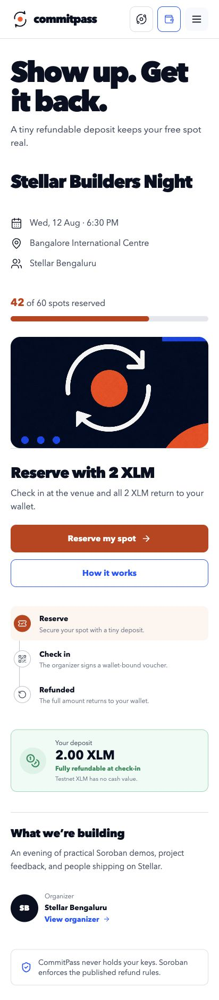
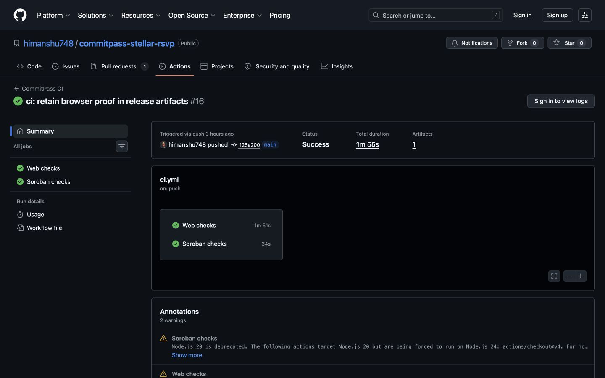
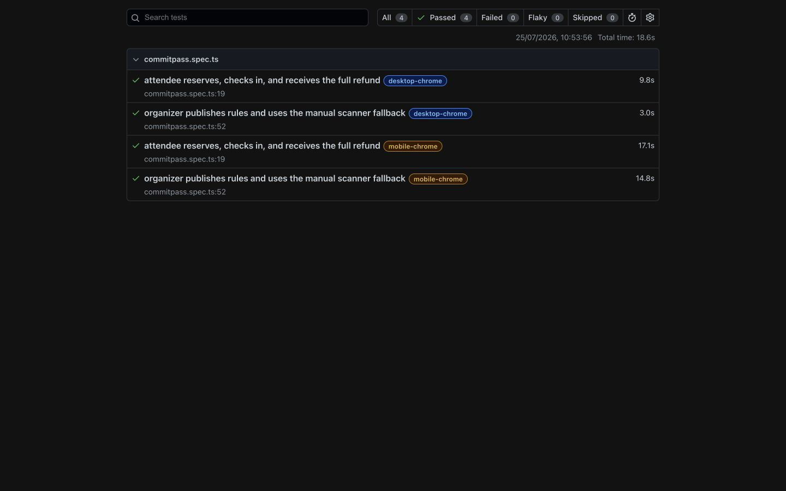
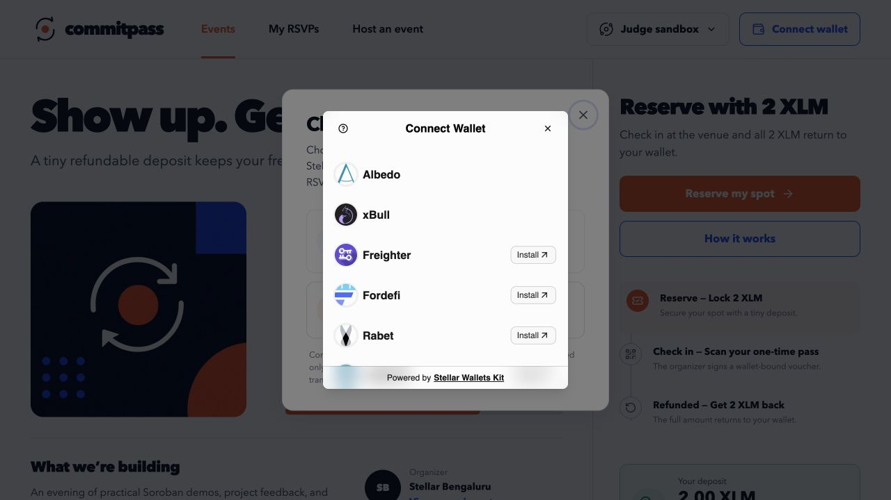

# CommitPass

**A refundable RSVP for real turnout.**

CommitPass lets an event organizer require a small XLM commitment for a free
event. An attendee reserves a place by locking the published amount in a
Soroban contract. At the venue, an event-scoped scanner signs a short-lived,
wallet-bound check-in voucher. The attendee submits that voucher and receives
the full deposit back. Unclaimed no-show deposits settle only to the beneficiary
disclosed before reservation.

## Rise In reviewer evidence

This repository is a monorepo. The React application and all wallet integration
source live in [`frontend/`](frontend/). Reviewers can use the
[root evidence index](REVIEWER_EVIDENCE.md) or open the direct proof below.
The core White, Yellow and Orange implementation was present in the pre-review
[`aa2f626` commit](https://github.com/himanshu748/commitpass-stellar-rsvp/commit/aa2f62631f7a86c922ee5c0ff2f552918ee4d28c).
The August sprint responds to the commit-count review with thirteen meaningful
product and production-readiness commits.

### August challenge correction

The August challenge work contains thirteen meaningful commits after the July
review baseline. Reviewers can inspect the complete
[August comparison](https://github.com/himanshu748/commitpass-stellar-rsvp/compare/cdeb8361d3c79920ba07f9be2b4982308d6e12b0...main).

1. Count unique wallets with verifiable contract activity.
2. Boot from validated runtime deployment configuration.
3. Page the complete contract event history.
4. Validate and summarize pilot feedback.
5. Add an accessible pilot feedback form.
6. Collect feedback after a successful attendee refund.
7. Canonicalize production event terms and metadata hashes.
8. Persist versioned organizer drafts safely.
9. Verify RPC and contract readiness with bounded read-only checks.
10. Add a tested read-only system status screen with safe degraded states.
11. Preserve the last verified health result during failed refreshes.
12. Publish deduplicated Testnet pilot analytics with explorer proof.
13. Export a privacy-safe JSON evidence report from public ledger activity.

### White Belt wallet proof

- [`frontend/package.json`](https://github.com/himanshu748/commitpass-stellar-rsvp/blob/main/frontend/package.json#L15-L18)
  installs `@creit.tech/stellar-wallets-kit` 2.5.0 and
  `@stellar/stellar-sdk`.
- [`frontend/src/lib/wallet.ts`](https://github.com/himanshu748/commitpass-stellar-rsvp/blob/main/frontend/src/lib/wallet.ts#L130-L190)
  initializes Stellar Wallets Kit, opens its permission and wallet chooser with
  `authModal`, validates the returned address and restores it with `getAddress`.
- [The same wallet adapter](https://github.com/himanshu748/commitpass-stellar-rsvp/blob/main/frontend/src/lib/wallet.ts#L217-L275)
  disconnects the selected wallet and signs transaction XDR with
  `StellarWalletsKit.signTransaction`.
- [`CommitPassProvider.tsx`](https://github.com/himanshu748/commitpass-stellar-rsvp/blob/main/frontend/src/state/CommitPassProvider.tsx)
  connects and disconnects the live wallet in application state.
- [`AppHeader.tsx`](https://github.com/himanshu748/commitpass-stellar-rsvp/blob/main/frontend/src/components/AppHeader.tsx)
  calls the live connection handlers. Its
  `Connect wallet` button
  and
  `Choose Stellar wallet` option
  provide the visible UI.
- [`stellar-account.ts`](https://github.com/himanshu748/commitpass-stellar-rsvp/blob/main/frontend/src/lib/stellar-account.ts#L87-L224)
  reads the Testnet XLM balance, builds the payment, requests the wallet
  signature and submits it to Horizon.

The application uses Stellar Wallets Kit rather than the raw Freighter API.
Wallets Kit performs provider permission and address access through
`authModal`, `fetchAddress` and `getAddress`, so a direct `setAllowed` call is
not expected.

### Yellow and Orange contract proof

- **Deployed Testnet contract:** [`CBIT5JKA4XGV37FIIMXNSXQNHTYC52P7J65JO6J3QRYQ3YP3DIZPZRRN`](https://stellar.expert/explorer/testnet/contract/CBIT5JKA4XGV37FIIMXNSXQNHTYC52P7J65JO6J3QRYQ3YP3DIZPZRRN)
- **Deployment transaction:** [`6e748b31…76f51`](https://stellar.expert/explorer/testnet/tx/6e748b3100fd70f03c10dadabbb62f0b064c0357a923bea7691b1ba084776f51)
- **Verified contract call:** [`f7e21895…ac83e`](https://stellar.expert/explorer/testnet/tx/f7e218954d1e4a75f5c6bbc8e6029b313592d37ab5301b7b7fa44c3e534ac83e)
- **Real XLM reservation:** [`2036256a…f83d3`](https://stellar.expert/explorer/testnet/tx/2036256aecb600793f87980cd02df92ba8eb3fae4b3ffb14901cb370f9cf83d3)
- **Scanner-signed refund:** [`291d1d02…3bdb`](https://stellar.expert/explorer/testnet/tx/291d1d02ad1a741b22db56440293fd8b65813ca7002387573505dae65f163bdb)

This repository is a complete Stellar Journey to Mastery Orange Belt submission:

- a polished responsive attendee and organizer web app;
- two protocol-27 Soroban contracts with 27 passing Rust tests;
- generated TypeScript bindings for both contracts and a typed application
  adapter;
- the official `@creit.tech/stellar-wallets-kit` 2.5.0 multi-wallet modal,
  network validation and hardened transaction signing;
- a mounted live Testnet proof panel that reads the deployed contract, invokes
  `create_event`, `reserve`, `voucher_message`, and
  `claim_check_in_refund` from the browser, shows each transaction lifecycle,
  and reconciles contract events with authoritative reads;
- a load-bearing native XLM SAC call in the deployed RSVP contract and a
  tested Event Directory contract that reads RSVP state across contracts;
- real camera QR scanning, strict pass validation, replay rejection and local
  Ed25519 signing in the judge sandbox;
- a deterministic in-session demo for judges without wallet setup;
- a public Stellar Testnet deployment and complete on-chain lifecycle proof;
- green CI covering contracts, generated clients, frontend tests, builds, and
  four desktop/mobile browser journeys, plus a reproducible release workflow;
- a read-only system status screen that checks RPC health, the latest ledger
  and the configured contract deposit token without a wallet signature;
- a threat model, pilot plan, Orange submission copy and 78-second demo.

## Try the product

Public production demo:
https://commitpass-stellar-rsvp.a-9724.chatgpt.site

Public source:
https://github.com/himanshu748/commitpass-stellar-rsvp

```sh
# Generated contract clients (required by the frontend)
npm --prefix packages/refundable-rsvp install
npm --prefix packages/refundable-rsvp run build
npm --prefix packages/event-directory install
npm --prefix packages/event-directory run build

# Web application
npm --prefix frontend install
npm --prefix frontend run dev
```

Open the local URL. The product deliberately offers two separate paths:

- **Use demo wallet** runs the complete RSVP → check-in → refund story locally
  without an extension or funds.
- **Choose Stellar wallet** opens the official Stellar Wallets Kit chooser.
  After a Testnet wallet connects, the live panel creates a one-seat event,
  reserves it with a 0.001 XLM commitment, obtains the contract's canonical
  voucher bytes, submits the event-scoped Ed25519 voucher and returns the full
  deposit. Every wallet-authorized write requires the wallet holder's own
  confirmation.

The full judge-sandbox flow is:

1. reserve the demo event with 2 Testnet XLM;
2. open the one-time check-in pass;
3. simulate the organizer scan;
4. claim the full refund;
5. create an organizer event and test the scanner fallback.

The narrative RSVP routes remain a clearly labelled no-funds judge sandbox for
fast evaluation. The separate live panel mounts the full contract-backed
create → reserve → signed check-in → refund loop on Testnet. Its published
commitment is 0.001 XLM (10,000 stroops). Testnet XLM has no cash value.

## Orange Belt live walkthrough

1. Connect a compatible Stellar wallet and keep it on **Testnet**.
2. Select **Create live Testnet event**. Review and approve the unique
   `create_event` invocation in the wallet.
3. Select **Reserve 0.001 XLM**. The generated client simulates the call, the
   wallet authorizes it and `reserve` calls the native XLM SAC `transfer`
   contract before the UI re-reads the reservation.
4. Wait for the short demonstration check-in window, then select **Claim
   check-in refund**. The browser asks the contract for canonical voucher bytes,
   signs them with the in-memory event-scoped scanner key and submits
   `claim_check_in_refund` with attendee authorization.
5. Confirm that the reservation reads `CheckedIn`, outstanding escrow returns
   to zero. The complete 0.001 XLM is refunded.
6. Inspect the event cursor: lifecycle events are treated as hints and followed
   by authoritative `get_event` / `get_reservation` reads.

Disconnecting, replacing the event or completing the refund destroys the
ephemeral scanner signer. It is never written to repository files, browser
storage, contract state or a backend.

## White Belt Testnet walkthrough

1. Install [Freighter](https://www.freighter.app/) from its official browser
   extension listing.
2. In Freighter, create or import a wallet and switch the network to
   **Testnet**.
3. Fund the public address with test-only XLM using
   [Stellar Laboratory's Friendbot](https://lab.stellar.org/account/fund).
4. Open CommitPass and choose **Connect wallet** → **Choose Stellar wallet**.
   Approve access in Freighter. CommitPass rejects a Mainnet connection.
5. Confirm that the panel shows the full connected address, `Testnet` and the
   native XLM balance returned by Horizon.
6. Enter a valid Testnet destination and a small amount. Review and approve the
   payment in Freighter.
7. The panel moves through waiting → submitting → confirmed (or failed) and
   returns the real transaction hash with a Stellar Expert Testnet link.
8. Use **Refresh balance** to load the post-transaction balance and
   **Disconnect** to clear the app and wallet-adapter session.

Never enter a seed phrase into CommitPass. The app requests only the public
address and a wallet signature for the transaction XDR.

## Yellow Belt Testnet walkthrough

1. Open **Connect wallet** → **Choose Stellar wallet**. The Stellar Wallets Kit
   modal lists its supported wallet modules and indicates which providers are
   available in the current browser.
2. Choose an installed wallet, approve address access and keep it on
   **Testnet**. CommitPass verifies the G-address and selected wallet identity.
   It validates the reported passphrase when the module supports that query and
   always pins every signing request to the Testnet passphrase.
3. Inspect **Authoritative contract read**. It calls `get_event` against the
   deployed contract. **Cursor-based event sync** polls successful application
   events and treats each event only as a signal to read contract state again.
4. Select **Create live Testnet event**. CommitPass builds a unique one-seat
   `create_event` invocation with the connected address as organizer and
   beneficiary. A fresh, unlinkable scanner public key is retained only for the
   current in-memory live loop. Event creation itself transfers no XLM; only the
   Testnet network fee applies.
5. Review and approve the exact invocation in the wallet. The panel reports
   simulation → awaiting signature → submitted → pending → confirmed or a
   specific failure.
6. Open the returned Stellar Expert link. A confirmed `event_created` signal
   is followed by an authoritative `get_event` read. The Orange walkthrough can
   then continue through reservation, canonical voucher signing and refund.
7. Try the safe failure paths as needed: no compatible wallet, cancel the
   wallet request, switch the wallet away from Testnet or use an unfunded
   Testnet account. The UI reports wallet unavailable, request rejected, wrong
   network and insufficient balance separately.

A previously verified call to the same deployed `create_event` method is
public at
[`f7e21895…ac83e`](https://stellar.expert/explorer/testnet/tx/f7e218954d1e4a75f5c6bbc8e6029b313592d37ab5301b7b7fa44c3e534ac83e).
That historical transaction proves the deployed method and contract; this
README does not claim it was signed through the browser flow in the current
session. A fresh browser write always requires the connected wallet holder's
approval.

## Product screenshots

### Orange Belt evidence

Responsive production UI:



Green GitHub Actions run:



Four passing desktop/mobile Playwright journeys:



### Production multi-wallet chooser

Captured from the public Yellow Belt deployment. The modal is rendered by the
official Stellar Wallets Kit and exposes multiple supported wallet providers.



### Responsive attendee experience


### Early interaction concepts


## Public Testnet proof

| Artifact | Public value |
| --- | --- |
| Deployed Testnet contract | [`CBIT5JKA4XGV37FIIMXNSXQNHTYC52P7J65JO6J3QRYQ3YP3DIZPZRRN`](https://stellar.expert/explorer/testnet/contract/CBIT5JKA4XGV37FIIMXNSXQNHTYC52P7J65JO6J3QRYQ3YP3DIZPZRRN) |
| Native Testnet XLM SAC | `CDLZFC3SYJYDZT7K67VZ75HPJVIEUVNIXF47ZG2FB2RMQQVU2HHGCYSC` |
| Wasm SHA-256 | `e6c17cb2c717609f18a34afd69569ea3661641f855584136efe09226c095ea81` |
| Wasm upload transaction | [`31f0ccaa…33c7a`](https://stellar.expert/explorer/testnet/tx/31f0ccaab93ece2199405e05d1c00f3f9380af70e43e44d2b9ef14fd72633c7a) |
| Contract deployment transaction | [`6e748b31…76f51`](https://stellar.expert/explorer/testnet/tx/6e748b3100fd70f03c10dadabbb62f0b064c0357a923bea7691b1ba084776f51) |
| Event creation transaction | [`f7e21895…ac83e`](https://stellar.expert/explorer/testnet/tx/f7e218954d1e4a75f5c6bbc8e6029b313592d37ab5301b7b7fa44c3e534ac83e) |
| Real 2 XLM reservation transaction | [`2036256a…f83d3`](https://stellar.expert/explorer/testnet/tx/2036256aecb600793f87980cd02df92ba8eb3fae4b3ffb14901cb370f9cf83d3) |
| Scanner-signed 2 XLM refund transaction | [`291d1d02…3bdb`](https://stellar.expert/explorer/testnet/tx/291d1d02ad1a741b22db56440293fd8b65813ca7002387573505dae65f163bdb) |
| Verification event ID | `287273b2c9e628b24d70322796f89a989a557095b78ce275c7c019f0619be51f` |

The constructor permanently pins the same-network native XLM SAC. The pinned
address was read back from the deployed contract after deployment. The
verification event completed the real reserve → scanner signature → attendee
refund lifecycle on public Testnet. That permanent explorer fixture used
2 Testnet XLM for easy ledger inspection; the current browser walkthrough uses
the smaller 0.001 Testnet XLM commitment disclosed in the UI.

## Run the checks

```sh
# Contract
cd contracts
cargo fmt --all -- --check
cargo clippy --workspace --all-targets -- -D warnings
cargo test --workspace
cargo build --target wasm32v1-none --release --package refundable-rsvp
cargo build --target wasm32v1-none --release --package event-directory

# Generated bindings
cd ../packages/refundable-rsvp
npm install
npm run build
cd ../event-directory
npm install
npm run build

# Web application
cd ../../frontend
npm install
npm test
npm run lint
npm run build
npm run test:e2e
npm audit --omit=dev
```

The public CI run for commit `aa2f626` is
[green](https://github.com/himanshu748/commitpass-stellar-rsvp/actions/runs/30148297086)
and retains its Playwright report and screenshots as a workflow artifact.

## Integration boundary

CommitPass intentionally exposes two clearly separated experiences:

- the narrative judge sandbox, whose receipts are local and labelled demo
  state; and
- the live Testnet panel, whose event, reservation, voucher, refund, balances,
  transaction hashes and contract reads come from the deployed Soroban
  contract.

`GeneratedRefundableRsvpAdapter` handles simulation, typed errors, wallet
authorization, submission, restoration, polling and result decoding.
`CommitPassProvider` mounts the complete live lifecycle and holds the
event-scoped scanner key only for that in-memory browser session. Contract
events such as `event_created`, `reserved`, `checked_in`, cancellation, refund
and no-show signals are synchronization hints rather than a second state store;
every relevant signal triggers an authoritative contract read.

The deployed RSVP contract performs load-bearing inter-contract communication
with the native XLM SAC. The second custom Event Directory contract is tested,
has generated bindings, is built in CI and calls RSVP read methods; it is
release-ready but is not represented as publicly deployed in this submission.
Before a real-value pilot, replace the browser-held event signer with an
isolated signer or secure device keystore and complete an independent audit.

## Repository map

```text
contracts/refundable-rsvp/   Soroban contract and Rust tests
contracts/event-directory/   Read-only cross-contract RSVP index and tests
packages/refundable-rsvp/    Generated TypeScript contract client
packages/event-directory/    Generated TypeScript directory client
frontend/                    React/Vite app, unit tests and Playwright tests
deployments/                 Reproducible public Testnet proof manifest
scripts/                     Build, verify and deployment workflows
docs/                        Product, architecture, security, pilot and submission docs
```

## Security boundary

CommitPass provides **organizer-attested attendance with cryptographic
anti-replay**. It is not a trustless proof that a person was physically present.
A compromised scanner key can authorize refunds during its event window, but it
cannot redirect a refund away from the wallet bound into the voucher and the
attendee must still authorize the claim.

The scanner private key is never stored on-chain. The MVP keeps it in memory;
production pilots need an isolated signer or secure device keystore. The
contract has received an internal focused review with no remaining Critical,
High or Medium findings. It has not received an independent audit and
must not custody Mainnet funds until it does.

Before publication, a GitGuardian-compatible local scan of the tracked tree and
full Git history found no high-confidence credential patterns. The evidence
index records the narrower scan details and discloses that official `ggshield`
was not run because no GitGuardian API token is configured.

Read [the architecture](docs/ARCHITECTURE.md),
[the threat model](docs/SECURITY.md), and
[the Orange evidence index](docs/ORANGE_BELT.md). Read the
[pilot plan](docs/PILOT_PLAN.md) before a production pilot.

## Rise In fit

The White Belt evidence remains intact: real Testnet wallet connection, balance
read, user-approved XLM payment support, transaction result/hash, public
repository, setup guide and screenshots.

The Yellow Belt evidence adds the official Stellar Wallets Kit 2.5.0
multi-wallet chooser; explicit wallet, rejection, network and balance errors;
a deployed Testnet contract called from the frontend; a visible transaction
lifecycle; and cursor-based event synchronization followed by authoritative
reads. The public `create_event` transaction above is independently verifiable.
A fresh browser signature is intentionally left to the wallet holder and is not
claimed as automation evidence.

The Orange Belt deliverable adds the complete contract-backed browser loop,
advanced inter-contract calls, an Event Directory contract, lifecycle event
reconciliation, responsive and explicit failure states, 27 Rust tests, 97
frontend tests, four Playwright journeys, green CI/CD, release artifacts,
deployment proof, screenshots and a one-to-two-minute demo.

Green, Blue and Black completion are not claimed. Secure pilot scanner
operations, real-user evidence, an independent audit and Mainnet readiness
remain later milestones.

Program terms and prize decisions remain solely with Rise In and Stellar:
[Stellar Journey to Mastery](https://www.risein.com/programs/stellar-journey-to-mastery-monthly-builder-challenges).

## License

No license has been selected yet. Add one before accepting outside
contributions.
